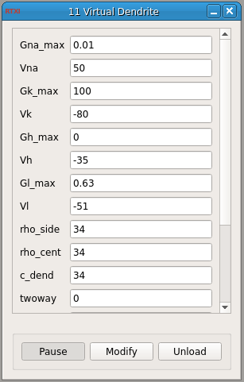

###Virtual Dendrite

**Requirements:** None  
**Limitations:** None noted

<!--start-->
“Attaches” a cable to your cell through which synaptic inputs are “passed” before RTXI injects the resultant current into the recording site. 
<!--end-->

####Input Channels
1. input(0) - Vright
2. input(1) - Vleft
3. input(2) - Vcent
4. input(3) - Iapp

####Output Channels
1. output(0) - Vold
2. output(1) - Iout

####Parameters
1. Gna_max
2. Vna
3. Gk_max
4. Vk
5. Gh_max
6. Vh
7. Gl_max
8. Vl
9. rho_side
10. rho_cent
11. c_dend
12. twoway
13. Ioffset

####States
1. m
2. h
3. n
4. q
